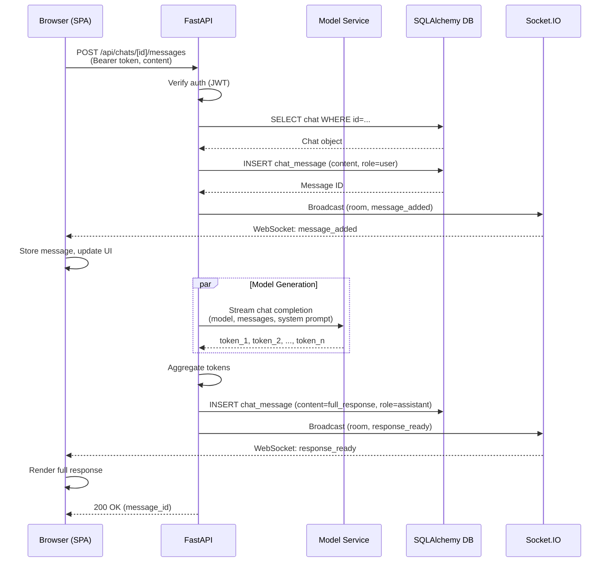
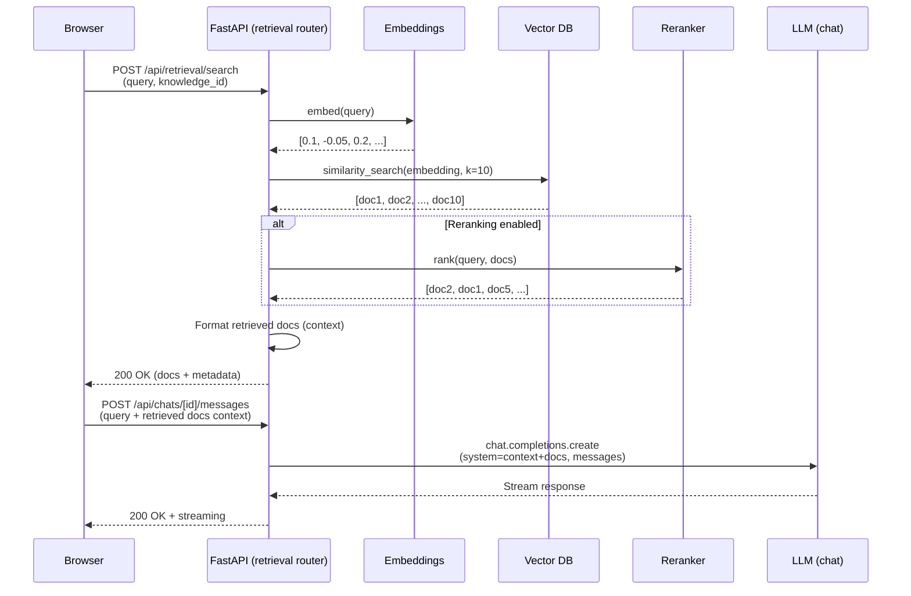
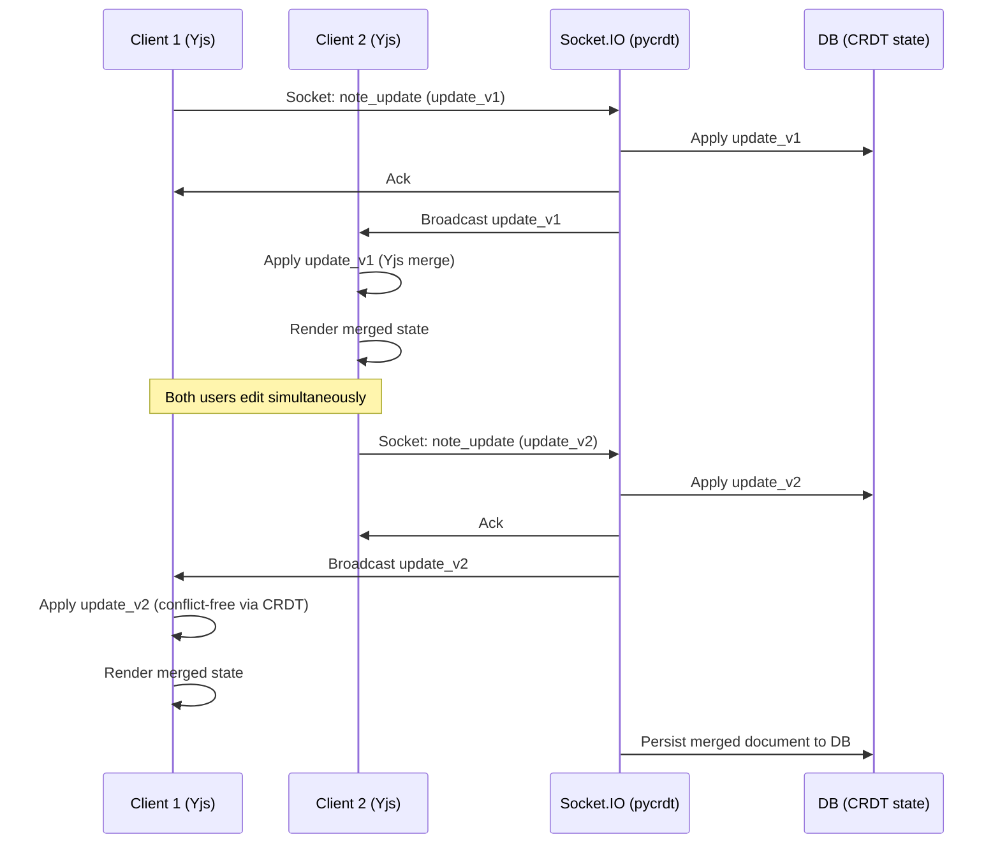

# System Architecture

## High-Level Overview

Burger Print runs **Open WebUI v0.9.6** as a SPA + FastAPI backend architecture, deployable via Docker, Docker Compose, or development mode (npm dev + uvicorn).

```
┌─────────────────────────────────────────────────────────────┐
│                    Browser (SPA)                             │
│         SvelteKit (Svelte 5) + Static Adapter               │
│  - Socket.IO (real-time chat/collaboration)                │
│  - Fetch API + Bearer Token (REST + SSE streaming)         │
│  - Stores (Svelte writable + derived)                      │
└────────────────┬────────────────────────────────────────────┘
                 │
    ┌────────────┴──────────────┐
    │ HTTP/WebSocket            │
    │ :8080 (Docker)            │
    │ :8000 (dev backend)       │
    │ :5173 (dev frontend)      │
    │                           │
┌───▼──────────────────────────────┐
│    FastAPI Server (Python)       │
│  - 30 routers (users, chats...) │
│  - Middleware (auth, audit...)  │
│  - Socket.IO (pycrdt + Redis)   │
│  - RAG pipeline (loaders, rank) │
└───┬──────────────────────────────┘
    │
    ├─────────────┬───────────────┬──────────────┐
    │             │               │              │
┌───▼──┐   ┌─────▼──┐    ┌──────▼──┐  ┌───────▼──┐
│SQLite│ │ PostgreSQL  │ Vector DBs│ │Redis    │
│ dev  │ │ Production  │ (Qdrant...) │ Cache+SocketIO
└──────┘ └────────────┘ └────────────┘ └─────────┘
```

---

## Component Architecture

### Frontend Layer (SvelteKit)

**Technology Stack**:
- Svelte 5.53.10 + SvelteKit 2.5.27 (adapter-static for SPA)
- TypeScript 5.5.4 (strict mode)
- Tailwind CSS 4 + Bits UI v2 (headless components)
- Vite 5.4.21 (build, dev server)

**Key Responsibilities**:
1. **Authentication** — OAuth/login form, session token storage
2. **Chat UI** — Message rendering, streaming (SSE), code blocks, markdown
3. **Admin Panel** — Model/auth/knowledge/group management
4. **Workspace** — Knowledge base, prompt library, tools, settings
5. **Real-time** — WebSocket subscription, CRDT note editing, presence

**State Management**:
- Svelte stores (40+ writable + derived): user, chats, models, config, theme, socket, locale
- No global state library (Redux/Zustand); Svelte stores are lightweight, reactive
- Store subscriptions in components via `$store` syntax

**API Communication**:
- Fetch + Bearer token pattern (30 API modules in `lib/apis/`)
- EventSource for server-sent events (chat streaming)
- Socket.IO client for real-time updates

**Routes**:
```
/ (public home)
├── /auth/login (public)
├── /auth/register (public)
├── /s/[id] (public share)
├── (app)/ (protected, requires auth)
│   ├── /c/[id] (chat view)
│   ├── /notes (collaborative notes)
│   ├── /channels (team chat)
│   ├── /workspace (models, knowledge, prompts, tools)
│   ├── /admin/[tab] (model/auth/knowledge/group mgmt)
│   └── /playground (RAG testing)
```

### Backend Layer (FastAPI)

**Technology Stack**:
- FastAPI 0.135.1 (async ASGI)
- Uvicorn 0.41.0 (ASGI server)
- SQLAlchemy 2.0 async ORM (async_sessionmaker)
- Alembic 1.18.4 (schema migrations)
- python-socketio 5.16.1 (WebSocket, Redis adapter)

**Core Responsibilities**:
1. **Authentication & Authorization** — JWT/API key validation, RBAC, OAuth/OIDC/LDAP
2. **Chat Management** — Create/list/edit chats, message history, branching
3. **Model Integration** — Route to OpenAI, Ollama, Azure, Bedrock, etc.
4. **RAG Pipeline** — Document upload, embedding, vector search, reranking
5. **Tools & Functions** — MCP servers, custom function tools, skill automation
6. **Real-time Collaboration** — CRDT-based notes (pycrdt + Yjs), Socket.IO pub/sub
7. **Observability** — Audit logging, OpenTelemetry tracing, metrics

**Router Architecture** (30 endpoints):

| Domain | File | Entities |
|--------|------|----------|
| **Identity** | `auths.py`, `users.py` | User, Auth (OAuth/LDAP), AccessGrant |
| **Chat** | `chats.py`, `chat_messages.py` | Chat, ChatMessage |
| **Collaboration** | `channels.py`, `notes.py` | Channel, Note (CRDT) |
| **Models** | `models.py`, `ollama.py`, `openai.py` | Model registry + integrations |
| **RAG** | `retrieval.py`, `knowledge.py`, `files.py` | Document indexing, vector search |
| **Tools** | `tools.py`, `functions.py`, `skills.py` | MCP, custom functions, workflows |
| **Media** | `images.py`, `audio.py` | Image generation, speech (Whisper, TTS) |
| **Admin** | `configs.py`, `groups.py`, `scim.py` | Settings, RBAC, LDAP provisioning |
| **Observability** | `analytics.py`, `evaluations.py`, `tasks.py` | Metrics, benchmarks, job queue |
| **Extensibility** | `pipelines.py`, `automations.py` | Custom middleware, workflow triggers |

**Middleware Stack** (order matters):

| Middleware | Purpose |
|-----------|---------|
| Compress | Brotli/gzip response compression |
| Redirect | HTTPS redirect, trailing slash normalization |
| SecurityHeaders | X-Frame-Options, CSP, HSTS, X-Content-Type-Options |
| CORS | Cross-origin filtering (configurable origins) |
| AuthToken | JWT/API key extraction, request signing |
| Session | StarSessions (Redis-backed, persistent) |
| WebSocketGuard | Upgrade protocol validation |
| AuditLog | All API calls logged (user, model, tokens, latency) |

### Database Layer

**Schema** (25+ entities via SQLAlchemy):

| Entity | Purpose | Key Fields |
|--------|---------|-----------|
| User | User account | id, email, username, role, settings |
| Chat | Conversation | id, user_id, title, messages[], metadata |
| ChatMessage | Message | id, chat_id, content, role, model, tokens |
| Channel | Team chat room | id, name, members[], settings |
| Knowledge | Document collection | id, name, embedding_model, vector_db |
| File | Indexed document | id, knowledge_id, name, chunks[], metadata |
| Note | Collaborative text | id, user_id, content (CRDT), collaborators[] |
| Memory | Context memory | id, chat_id, content, relevance_score |
| Tool | Custom function | id, name, description, params_schema |
| Auth | OAuth/LDAP provider | id, type, client_id, scopes |
| Automation | Workflow | id, name, trigger, actions[], enabled |
| Task | Background job | id, status, result, created_at, updated_at |
| Group | RBAC group | id, name, members[], permissions[] |
| Model | Registry entry | id, name, type, config (API key, URL, etc.) |
| Config | Global setting | key, value, type (int, str, json) |

**Migrations** (Alembic):
- 46 versioned schema changes (init → v0.9.6)
- Automatic downtime-free migrations (add columns with defaults, rename in steps)
- Rollback-safe (each migration has `upgrade()` and `downgrade()`)

### Vector DB Integration (RAG Pipeline)

**Architecture**:
```
Document Upload
    │
    ├─ Loader (PDF/web/OCR/etc.)
    │
    ├─ Embedding Model (all-MiniLM-L6-v2 default)
    │
    ├─ Vector DB (15 backends: Qdrant, Chroma, PgVector, Milvus, Pinecone, ...)
    │
    ├─ Reranking (optional: cross-encoder)
    │
    └─ Search (hybrid: semantic + BM25)
```

**Supported Backends**:
1. **PgVector** (PostgreSQL native) — best for integrated DB
2. **Qdrant** (dedicated vector DB) — high performance, cloud managed
3. **Chroma** (embedded default) — simple, no ops overhead
4. **Milvus** (open-source vector DB) — scalable, Kubernetes-ready
5. **Pinecone** (managed vector DB) — serverless, pay-per-query
6. **Weaviate** (knowledge graph DB) — semantic search + property filters
7. **Elasticsearch** / **OpenSearch** (full-text + vectors) — existing ES deployments
8. **MariaDB**, **Oracle 23AI**, **OpenGauss** — enterprise DB vectors
9. **S3Vector** (S3-based index) — low-cost cloud storage
10. **Valkey** (Redis alternative) — in-memory vector store
11-15. Hybrid and other specialized backends

**Loaders** (9 document types):
- **Marker** — PDF, HTML to markdown
- **MinEru** — Complex scientific layouts, OCR-heavy docs
- **Mistral** — Mistral platform content
- **Tavily** — Web search results integration
- **YouTube** — Video transcript extraction
- **PaddleOCR** — Scanned documents, images
- **Jira** — JIRA issues/tickets
- **S3** — AWS S3 bucket crawl
- **Web** — Generic web crawler

### Socket.IO & Real-Time Collaboration

**Technology**:
- python-socketio 5.16.1 (ASGI-compatible)
- Redis adapter (multi-server message bus)
- pycrdt 0.12.47 (CRDT for conflict-free collab)
- Yjs (client-side CRDT sync)

**Capabilities**:
- **Live chat** — Message streaming, typing indicators, presence
- **Note collaboration** — Multi-user editing, conflict resolution
- **Pub/Sub** — Room-based message broadcasting
- **Scalability** — Redis distributes messages across uvicorn instances

**Example Flow**:
```
Client 1 types message → Socket.IO emit('chat:message', {...})
    ↓
FastAPI socket handler → broadcast to room (Redis pub/sub)
    ↓
All clients in room receive message (Yjs sync CRDT)
    ↓
Display in chat UI, persist to DB
```

### Configuration System

**Location**: `backend/open_webui/config.py` (128KB)

**Features**:
- 200+ persistent settings (env-backed with defaults)
- Hot-reload via Redis / DB (no restart needed)
- Categories: auth, models, RAG, integrations, UI, security, observability

**Example Settings**:
```python
WEBUI_SECRET_KEY              # Session encryption
OLLAMA_BASE_URL               # Local LLM endpoint
OPENAI_API_KEY                # Cloud model API key
VECTOR_DB                      # Choice: chroma, qdrant, pgvector, etc.
EMBEDDING_MODEL               # Sentence transformer model
CORS_ALLOW_ORIGIN             # Allowed origins (dev: *, prod: specific)
MAX_FILE_SIZE                 # Document upload limit (bytes)
JWT_EXPIRY_HOURS              # Token lifetime
```

---

## Data Flow Diagrams

### Chat Request Flow



### RAG Search Flow



### Real-Time Collaboration (Notes)



---

## Deployment Topology

### Docker Multi-Stage Build

```dockerfile
# Stage 1: Node 22 (frontend build)
FROM node:22-alpine
  → npm ci
  → npm run build
  → Static files in `dist/`

# Stage 2: Python 3.11-slim (runtime)
FROM python:3.11-slim
  ← Copy `dist/` from stage 1
  → pip install -r requirements
  → Download embedding models (all-MiniLM-L6-v2, whisper, tiktoken)
  → CMD: start.sh (uvicorn with static file serving)
```

**Build Arguments**:
- `USE_CUDA` — GPU support (cu117, cu121, cu128)
- `USE_OLLAMA` — Bundle Ollama (local LLM server)
- `USE_SLIM` — Minimal image (no embedding models pre-downloaded)
- `USE_PERMISSION_HARDENING` — Non-root user, restricted permissions

### docker-compose Variants

| File | Services | Use Case |
|------|----------|----------|
| `docker-compose.yml` | web, db (PostgreSQL), redis, milvus | Full stack, production baseline |
| `docker-compose-launcher.sh` | Detect GPU (NVIDIA/AMD) + compose | Auto GPU setup |
| `docker-compose-gpu.yml` | Add NVIDIA GPU device | NVIDIA CUDA |
| `docker-compose-api.yml` | FastAPI only (no frontend) | API-only deployment |
| `docker-compose-data.yml` | Redis, PostgreSQL, vector DBs only | Microservices backend |
| `docker-compose-otel.yml` | Add Grafana LGTM (Loki, Grafana, Tempo) | Observability stack |

### Development Mode

```bash
# Terminal 1: Frontend (Vite dev server)
cd src/open-webui
npm install
npm run dev
# → SvelteKit on http://localhost:5173

# Terminal 2: Backend (Uvicorn with reload)
cd src/open-webui/backend
./dev.sh
# → FastAPI on http://localhost:8000
# → Frontend proxies to /api/* → http://localhost:8000

# SvelteKit dev server (vite.config.js) proxies API calls:
# /api/* → http://localhost:8000
```

### Production Topology

```
User
  ↓ (HTTPS)
┌─────────────────┐
│  Reverse Proxy  │ (nginx, Traefik, or cloud LB)
│  - SSL/TLS      │
│  - Rate limit   │
│  - Static cache │
└────────┬────────┘
         ↓
┌─────────────────────────────────────┐
│  FastAPI Container (K8s pod)        │
│  - Uvicorn + 4 workers              │
│  - Port 8080 (health, API, SPA)     │
│  - Socket.IO (WebSocket upgrade)    │
└────┬────────────────────────────────┘
     ↓
┌──────────────────────────────────┐
│ PostgreSQL Cluster (HA)          │
│ Redis Cluster (sessions, cache)  │
│ Vector DB (Qdrant / PgVector)    │
└──────────────────────────────────┘
```

### Scaling Considerations

1. **Frontend** — Static SPA; serve via CDN (CloudFront, Netlify, Cloudflare)
2. **Backend** — Stateless FastAPI (scale horizontally with K8s replicas)
3. **Socket.IO** — Redis adapter distributes messages across uvicorn instances
4. **Database** — PostgreSQL with read replicas; Vector DB with sharding
5. **File Storage** — S3 or MinIO for document uploads

---

## Security Architecture

### Authentication & Authorization

**Flow**:
```
User login (email + password OR OAuth/OIDC provider)
  ↓
FastAPI /api/auths/login validates credentials
  ↓
Generate JWT token (exp: 30d, sub: user_id)
  ↓
Return token to client (httponly cookie or localStorage)
  ↓
Client: Include Bearer token in all API requests
  ↓
Middleware: Verify JWT, extract user_id
  ↓
Router: Check RBAC (user.role) + attribute-based rules (knowledge_id, chat_id, group)
```

**Supported Methods**:
- Local: username + bcrypt password
- OAuth 2.0: Google, GitHub, OpenAI
- OIDC: Azure AD, Okta, Keycloak
- LDAP/SCIM: Enterprise directory

### Data Security

| Layer | Mechanism |
|-------|-----------|
| **Transport** | HTTPS/TLS (reverse proxy enforces) |
| **Session** | JWT (signed, no session storage needed) |
| **Database** | Encrypted fields (bcrypt for passwords, TBD for PII) |
| **Files** | S3 server-side encryption (optional) |
| **RAG docs** | Access control (knowledge_id, user_id checks) |

### Audit & Compliance

- **Audit Log**: Every API call logged (user_id, endpoint, status, latency, model_id, tokens)
- **Telemetry**: Usage analytics, no PII in logs
- **OpenTelemetry**: Distributed tracing for debugging
- **Secrets**: Environment variables only (no hardcoded API keys)

---

## Performance Characteristics

| Component | Baseline | Notes |
|-----------|----------|-------|
| **Chat latency** | 100–500ms (streaming token by token) | Depends on model (local vs cloud) |
| **RAG search** | 50–200ms (vector DB query) | Depends on doc count + embedding model |
| **WebSocket message** | <50ms (local broadcast) | Redis adds ~50ms in distributed setup |
| **Note CRDT sync** | <100ms | Yjs handles conflict resolution client-side |
| **Page load** | 500ms–2s | SPA (dist/ is ~5MB gzipped) |
| **DB query** | 5–50ms (async) | Depends on query complexity + index coverage |

---

## Failure Modes & Resilience

| Failure | Handling |
|---------|----------|
| **Model API down** | Fallback chain (if configured); graceful degradation |
| **Vector DB down** | RAG disabled; chat works without retrieval |
| **Redis down** | Session loss; Socket.IO falls back to polling (slower) |
| **Database down** | API returns 503; clients show "Service Unavailable" |
| **Embedding service down** | File upload blocked; can't add new docs (retrieval still works for existing docs) |
| **Network partition** | WebSocket reconnect after timeout (30s default) |

---

## Unresolved Questions

- Custom embedding model selection (fine-tuned models for specific domains)?
- Vector DB choice for production (Qdrant vs managed Pinecone vs self-hosted Milvus)?
- Database replication strategy (PostgreSQL streaming replication vs physical backup)?
- Multi-region deployment (sync vs async across regions)?
